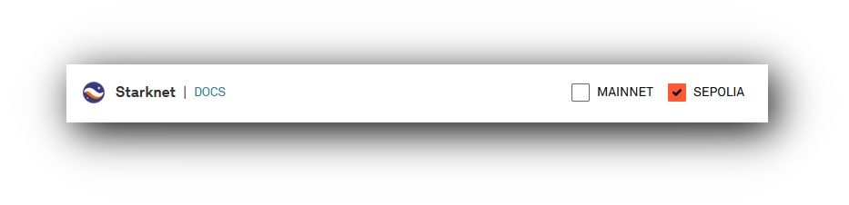

# StarkExplorer

A tool to view and analyse transactions, blockchain metrics and other data, using the Infura API. 
Inspired to some extent by [StarkScan](https://starkscan.co/) and [Etherscan](https://etherscan.io/).

# Status
A basic console program is working. This has been tested on Windows but should also work on Linux and MacOs. 

Showing the latest block

Showing a block with transactions

# Future work
* Develop the StarkExplorerLib library to retrieve more data such as Events and Contracts.
* Develop a GUI to allow easier user access.
* Store retrieved data in a local cache dB and check for local presence before requesting new data.
* Develop analysis functionality: I like the [blockchain intelligence](https://www.chainalysis.com/blockchain-intelligence/) concepts and abilities of [Chainalysis](https://www.chainalysis.com/).
* Develop access to other Blockchains: Infura has access to Ethereum Mainnet, Polygon, Optimism and others.

# Infura API key
Stark data is fetched via the [Infura Starknet API](https://docs.infura.io/api/networks/starknet).
I have used a [free Infura account](https://www.infura.io/pricing) that gives
* 1 API key
* 100,000 Total Requests/Day
* 10 Requests/Second

Which is more than enough for my requirements.

An API key is required and should be stored as an environment variable called ``INFURA_APIKEY`` on the machine that runs StarknetExplorer. This is so that the key does not have to be stored in a software repository, Github in this case. The app will throw an exception if it cannot find ``INFURA_APIKEY``.

Note that you will need to set access at
https://app.infura.io/key/INFURA_APIKEY/all-endpoints 
Specifically, the Starknet endpoints:

Select MAINNET for Live and/or SEPOLIA for testing.

# Credits

| Library  | Function  | Link  |
| --- | ---   |  --- |
| Json.NET | .Net JSON framework | https://www.newtonsoft.com/json |
| NUnit | .Net Unit-testing framework | https://nunit.org/ |
| NLog | .Net Logging platform | https://nlog-project.org/  |
|   |   |   |
|   |   |   |

